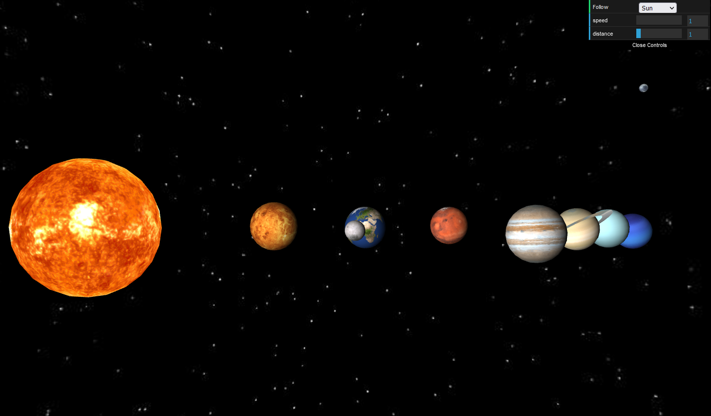

# SolarSystemProject
3D Model of the Solar System using Raw WebGL

Can be viewed live [here](https://solar-system-3d.herokuapp.com/)

## Developers
- Gianluca Guarro

## Implementation
- Object creation and texture mapping
- Shaders
- Space Navigation
- Configuration of celestial objects (axial tilt, size, positioning)
- GUI to control scaling and speed

## External Libraries
- This project is built on WebGL.

- This project also makes use of [TWGL](https://twgljs.org/), a small library with the simple purpose of reducing the amount of boiler-plate code and verbosity of WebGL.